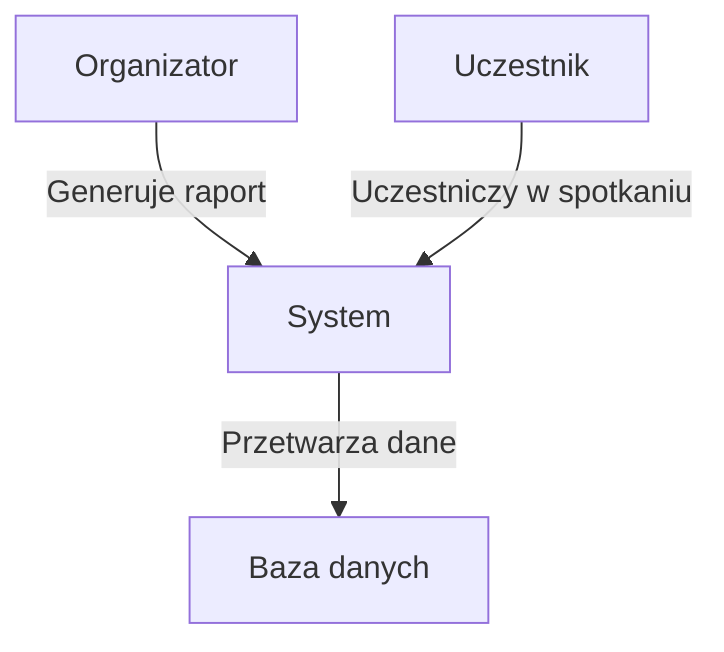
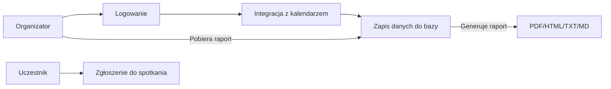
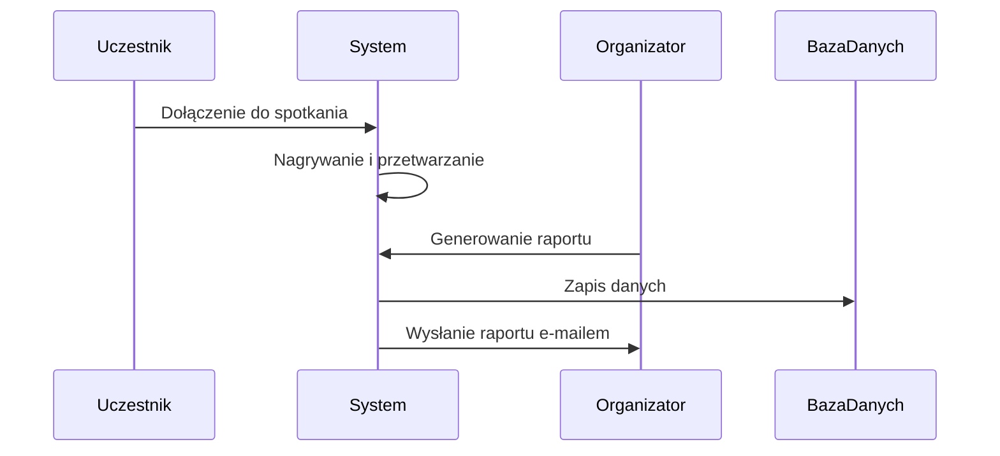

# Dokumentacja projektu: SmartMeetings – Automatyczne transkrypcje i notatki ze spotkań

## Członkowie zespołu:
- [Kamil Hebda](https://github.com/Kamil-Hebda)
- [Paweł Klocek](https://github.com/PawelekKlocek)
- [Szymon Gaweł](https://github.com/gawelszymon)

---

## 1. Macierz kompetencji zespołu
| Umiejętność                                      | Kamil Hebda | Paweł Klocek | Szymon Gaweł |
|--------------------------------------------------|-------------|-------------|-------------|
| Tworzenie rozszerzeń do przeglądarek            | tak         | tak         | tak         |
| Flask                                           | tak         | tak         | tak         |
| Node.js / Express.js                            | nie         | nie         | nie         |
| Java Spring                                     | nie         | tak         | nie         |
| Frontend (React)                                | tak         | nie         | tak         |
| SQL (bazy danych relacyjne)                     | tak         | tak         | tak         |
| NoSQL (bazy danych nierelacyjne)                | nie         | nie         | tak         |
| Sztuczna inteligencja / uczenie maszynowe       | tak         | tak         | nie         |
| RAG                                             | nie         | tak         | tak         |
| Narzędzia OCR                                   | nie         | tak         | nie         |
| PyTorch / TensorFlow                            | tak         | nie         | nie         |
| RestAPI                                         | tak         | nie         | tak         |
| TypeScript                                      | nie         | nie         | tak         |
| Docker/Docekr Compose                           | tak         | nie         | tak         |
| VPS                                             | nie         | nie         | tak         |
| Testowanie jednostkowe / integracyjne           | nie         | tak         | nie         |
| Testy end-2-end                                 | nie         | tak         | tak         |
| Postman (testowanie API)                        | tak         | nie         | nie         |
| API do transkrypcji mowy (Google Cloud, AWS)    | tak         | tak         | nie         |
| Agile                                           | nie         | tak         | nie         |
| Modele generatywne (ChatGPT, Gemini AI)         | nie         | nie         | tak         |
| Integracja z kalendarzami (Google, Outlook)     | nie         | tak         | nie         |
| Project Management                              | tak         | nie         | nie         |

---

## 2. Pytania i odpowiedzi związane z projektem

| Pytanie                                     | Odpowiedź                                                | Uwagi                                       |
|---------------------------------------------|----------------------------------------------------------|---------------------------------------------|
| Jaka ma to być aplikacja?                   | Webowa lub wtyczka do przeglądarki                       | Powinna działać niezależnie od narzędzia do telekonferencji |
| W jakim terminie należy oddać aplikację?    | Koniec stycznia 2025                                     |                                             |
| Obciążenie aplikacji                        | Nieokreślona liczba, zakładamy wsparcie dla dowolnej liczby uczestników | Skalowalność                               |
| Jakie funkcjonalności są priorytetowe?      | Transkrypcja, zapis zrzutów ekranu, OCR                  |                                             |
| Jakie dane mają być przetwarzane?           | Transkrypcja mowy, zrzuty ekranu, treści OCR             |                                             |
| Jak generowane są notatki?                  | Notatki w formatach PDF, HTML, TXT, MD                   |                                             |
| Jakie formaty eksportu są wymagane?         | PDF, HTML, TXT, MD                                       |                                             |
| Wspierane platformy do spotkan              | Zoom, Microsoft Teams, Google Meet                      | Możliwość rozbudowy o inne platformy       |
| Jak zarządzać spotkaniami?                  | Integracja z kalendarzem Googla                    )     |                                             |
| Czy aplikacja powinna działać automatycznie?| Powinna zapisywać utworzone spotkania do kalendarza      |                                             |
| Jakie dane użytkowników są wymagane?        | Teoretycznie brak, opcjonalnie email uczestników spotkań                         |                                             |
| Czy aplikacja ma wysyłać e-maile?           | Tak, przy użyciu Sendinblue                              |                                             |
| Czy raporty mają być wysyłane automatycznie?| Tak, e-mailem do uczestników spotkania                  | Brevo (ex Sendinblue)                  |
| Czy aplikacja ma identyfikować mówców?      | Tak, to opcjonalna funkcjonalność                        | Może wymagać zaawansowanego przetwarzania danych |
| Czy potrzebne są dodatkowe analizy statystyczne? | Tak, opcjonalnie analiza ilości i szybkości wypowiedzi uczestników | Do omówienia z klientem                    |

---

## 3. Ustalony format wejściowych, danych sesyjnych formsa

| E-mail uczestników | Zapis z prezentacji           | LLM prompt    | Google calender API |
|------------------- |---------------------          |-------------- |-------------------- |
| string             |  .png .pdf .jpg .png .doc     |string         | .json               |

Email uczestników są rozróżnianie w formsie poprzez wyrażenie reguralne, na bazie znaku '@' oraz separatorów takich jak np. 'spacja;', czy ',' w związku z tym aplikacja sama, inteligentnie powinna odfiltrować emaile użytkowników na bazie forms input.

### Przykładowe dane wejściowe

| E-mail uczestników                  | Zapis z prezentacji                                  | LLM prompt                                    | Google Calendar API JSON                                  |
|--------------------------------------|----------------------------------------------------|-----------------------------------------------|-----------------------------------------------------------|
| jankins@gpt.com pawelrus@yahoo.com | ["prezentacja_01.pdf", "slajd_1.png"]       | "Podsumuj kluczowe punkty spotkania."         | {  "title": "Spotkanie zarządu", "date": "2025-01-15T10:00:00Z" } |
| antman@op.com, ewunia@email.com | ["wykres_raport.jpg", "dokument.docx", "podsumowanie.pdf"] | "Wygeneruj listę działań na podstawie rozmowy." | {"title": "Prezentacja wyników", "date": "2025-02-10T14:30:00Z" } |
| michal.kowalczyk@email.com          | ["schemat_projektu.png", "notatki.doc"]           | "Zidentyfikuj najważniejsze wnioski."         | { "title": "Warsztaty AI", "date": "2025-03-05T09:00:00Z"} |

---

## 4. Opis modelowanego systemu

|                              |                                                                                                                                                             |
|------------------------------|-------------------------------------------------------------------------------------------------------------------------------------------------------------|
| **Aktorzy**                  | Uczestnicy spotkania, Organizator                                                                                                                           |
| **Opis**                     | System umożliwia automatyczne generowanie notatek, raportów oraz transkrypcji spotkań, a także wysyłkę raportów do uczestników.                             |
| **Dane**                     | Treść rozmów, zrzuty ekranu, dane z prezentacji i statystyki.                                                                                               |
| **Wyzwalacz**                | Organizator – przycisk „Zakończ i wygeneruj raport”.                                                                                                        |
| **Odpowiedź**                | Raport w wybranym formacie: PDF, HTML, TXT, MD.                                                                                                             |
| **Uwagi**                    | System powinien działać z platformami Zoom, Teams, Google Meet.                                                                                             |

---

## 5. Diagramy UML:

### Diagram przypadków użycia 

### Diagram przepływu danych

### Diagram sekwencyjny UML

---

## 6. Architektura systemu:

System składa się z trzech głównych komponentów:

1. **Logowanie i zarządzanie użytkownikami** – organizatorzy mogą autoryzować uczestników.
2. **Przetwarzanie spotkań** – transkrypcje, OCR, zrzuty ekranu.
3. **Generowanie i wysyłka raportów** – tworzenie raportów i automatyczna wysyłka e-mailem.

---

## 7. Język implementacji

- **Frontend:** HTML, CSS, JavaScript (React)
- **Backend:** Python (Flask)
- **Opcjonalnie:** Możliwość stworzenia wtyczki dla przeglądarek lub platform spotkań.

**Uzasadnienie:** Python zapewnia wszechstronność i łatwość obsługi API, a JavaScript/React jest intuicyjnym wyborem dla interfejsu użytkownika. Wybrane technologie pozwalają na efektywną współpracę między frontendem i backendem.
