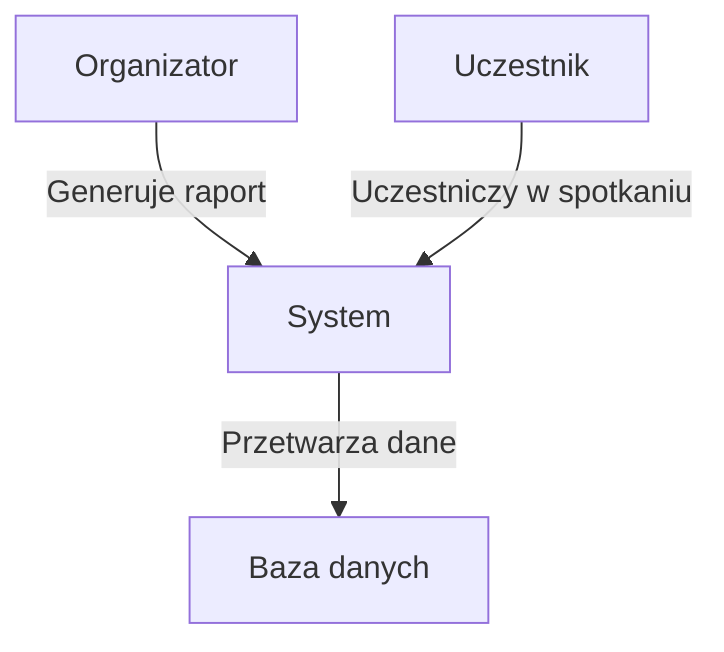
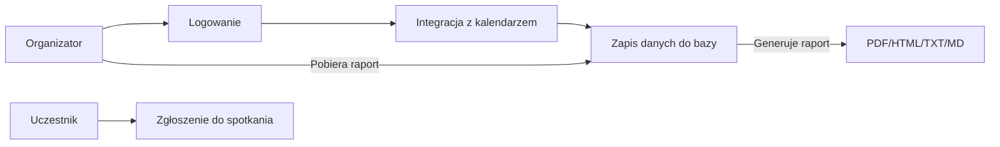
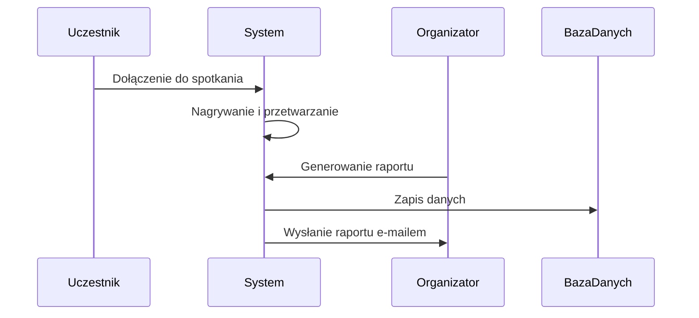

# Dokumentacja projektu: SmartMeetings – Automatyczne transkrypcje i notatki ze spotkań

## Członkowie zespołu:
- **Kamil Hebda**
- **Paweł Klocek**
- **Szymon Gaweł**

---

## 1. Macierz kompetencji zespołu

| Kompetencje              | Kamil | Paweł | Szymon |
|--------------------------|-------|-------|--------|
| Znajomość algorytmów     | TAK   | TAK   | TAK    |
| Uczenie maszynowe        | TAK   | TAK   | NIE    |
| Znajomość j. angielskiego| TAK   | TAK   | TAK    |
| Obsługa GitHub           | TAK   | TAK   | TAK    |
| Programowanie Python     | TAK   | TAK   | TAK    |
| Programowanie SQL        | TAK   | NIE   | TAK    |
| Programowanie C++        | TAK   | NIE   | NIE    |
| Programowanie JavaScript | NIE   | TAK   | TAK    |
| Znajomość API            | TAK   | TAK   | TAK    |
| Praca w grupie           | TAK   | TAK   | TAK    |
| Testowanie oprogramowania| TAK   | TAK   | TAK    |
| React                    | NIE   | NIE   | TAK    |
| HTML                     | TAK   | TAK   | TAK    |
| CSS                      | NIE   | NIE   | TAK    |

---

## 2. Pytania i odpowiedzi związane z projektem

| Pytanie                                 | Odpowiedź                                               | Uwagi                          |
|-----------------------------------------|---------------------------------------------------------|--------------------------------|
| W jakim terminie należy oddać aplikację?| Koniec stycznia 2025                                    |                                |
| Jakie funkcjonalności są priorytetowe?  | Transkrypcja, zapis zrzutów ekranu, OCR                 |                                |
| W jakiej formie ma być aplikacja?       | Aplikacja webowa lub wtyczka                            | Wtyczka jako opcjonalne rozwiązanie |
| Jak zarządzać spotkaniami?              | Integracja z kalendarzem i platformami (Zoom, Teams)    |                                |
| Jak generowane są notatki?              | Notatki w formatach PDF, HTML, TXT, MD                  |                                |
| Jakie dane użytkowników są wymagane?    | E-mail uczestnika, ID spotkania                         |                                |
| Czy aplikacja ma wysyłać e-maile?       | TAK, przy użyciu Sendinblue                             |                                |

---

## 3. Ustalony format danych wejściowych

| ID | E-mail uczestnika | Dane spotkania      | Zapis z prezentacji |
|----|-------------------|---------------------|---------------------|
| int (unique) | string         | JSON z kalendarza | .png lub .pdf       |

---

## 4. Opis modelowanego systemu

|                              |                                                                                                                                                             |
|------------------------------|-------------------------------------------------------------------------------------------------------------------------------------------------------------|
| **Aktorzy**                  | Uczestnicy spotkania, Organizator                                                                                                                           |
| **Opis**                     | System umożliwia automatyczne generowanie notatek, raportów oraz transkrypcji spotkań, a także wysyłkę raportów do uczestników.                             |
| **Dane**                     | Treść rozmów, zrzuty ekranu, dane z prezentacji i statystyki.                                                                                               |
| **Wyzwalacz**                | Organizator – przycisk „Zakończ i wygeneruj raport”.                                                                                                        |
| **Odpowiedź**                | Raport w wybranym formacie: PDF, HTML, TXT, MD.                                                                                                             |
| **Uwagi**                    | System powinien działać z platformami Zoom, Teams, Google Meet.                                                                                             |

---

## 5. Diagramy UML:

### Diagram przypadków użycia 

### Diagram przepływu danych

### Diagram sekwencyjny UML

---

## 6. Architektura systemu:

System składa się z trzech głównych komponentów:

1. **Logowanie i zarządzanie użytkownikami** – organizatorzy mogą autoryzować uczestników.
2. **Przetwarzanie spotkań** – transkrypcje, OCR, zrzuty ekranu.
3. **Generowanie i wysyłka raportów** – tworzenie raportów i automatyczna wysyłka e-mailem.

---

## 7. Język implementacji

- **Frontend:** HTML, CSS, JavaScript (React)
- **Backend:** Python (Flask)
- **Opcjonalnie:** Możliwość stworzenia wtyczki dla przeglądarek lub platform spotkań.

**Uzasadnienie:** Python zapewnia wszechstronność i łatwość obsługi API, a JavaScript/React jest intuicyjnym wyborem dla interfejsu użytkownika. Wybrane technologie pozwalają na efektywną współpracę między frontendem i backendem.
