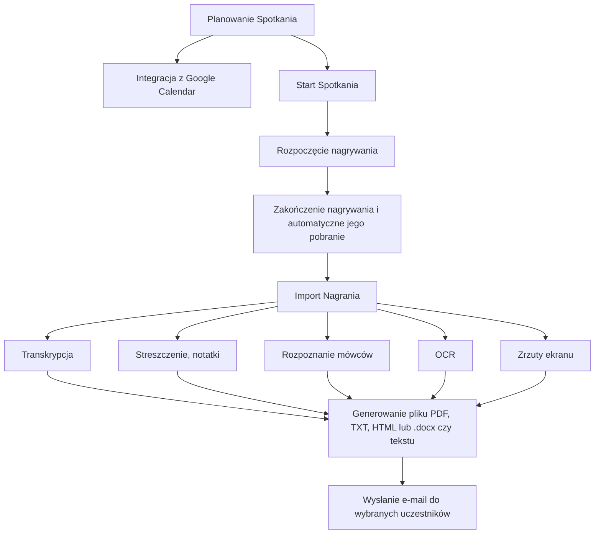
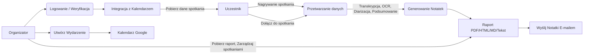
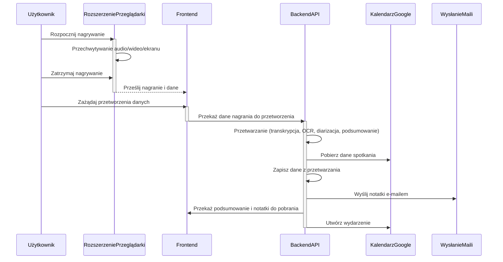

# Dokumentacja projektu: SmartMeetings – Automatyczne transkrypcje i notatki ze spotkań

## Członkowie zespołu:
- [Kamil Hebda](https://github.com/Kamil-Hebda)
- [Paweł Klocek](https://github.com/PawelekKlocek)
- [Szymon Gaweł](https://github.com/gawelszymon)

---

 
 

## 1. Macierz kompetencji zespołu
| Umiejętność                                      | Kamil Hebda | Paweł Klocek | Szymon Gaweł |
|--------------------------------------------------|-------------|-------------|-------------|
| Tworzenie rozszerzeń do przeglądarek            | tak         | tak         | tak         |
| Flask                                           | tak         | tak         | tak         |
| Node.js / Express.js                            | nie         | nie         | nie         |
| Java Spring                                     | nie         | tak         | nie         |
| Frontend (React)                                | tak         | nie         | tak         |
| SQL (bazy danych relacyjne)                     | tak         | tak         | tak         |
| NoSQL (bazy danych nierelacyjne)                | nie         | nie         | tak         |
| Sztuczna inteligencja / uczenie maszynowe       | tak         | tak         | nie         |
| RAG                                             | nie         | tak         | tak         |
| Narzędzia OCR                                   | nie         | tak         | nie         |
| PyTorch / TensorFlow                            | tak         | nie         | nie         |
| RestAPI                                         | tak         | nie         | tak         |
| TypeScript                                      | nie         | nie         | tak         |
| Docker/Docekr Compose                           | tak         | nie         | tak         |
| VPS                                             | nie         | nie         | tak         |
| Testowanie jednostkowe / integracyjne           | nie         | tak         | nie         |
| Testy end-2-end                                 | nie         | tak         | tak         |
| Postman (testowanie API)                        | tak         | nie         | nie         |
| API do transkrypcji mowy (Google Cloud, AWS)    | tak         | tak         | nie         |
| Agile                                           | nie         | tak         | nie         |
| Modele generatywne (ChatGPT, Gemini AI)         | nie         | nie         | tak         |
| Integracja z kalendarzami (Google, Outlook)     | nie         | tak         | nie         |
| Project Management                              | tak         | nie         | nie         |

---

 
 

## 2. Pytania i odpowiedzi związane z projektem

| Pytanie                                     | Odpowiedź                                                | Uwagi                                       |
|---------------------------------------------|----------------------------------------------------------|---------------------------------------------|
| Jaka ma to być aplikacja?                   | Webowa lub wtyczka do przeglądarki                       | Powinna działać niezależnie od narzędzia do telekonferencji |
| W jakim terminie należy oddać aplikację?    | Koniec stycznia 2025                                     |                                             |
| Obciążenie aplikacji                        | Nieokreślona liczba, zakładamy wsparcie dla dowolnej liczby uczestników | Skalowalność                               |
| Jakie funkcjonalności są priorytetowe?      | Transkrypcja, zapis zrzutów ekranu, OCR                  |                                             |
| Jakie dane mają być przetwarzane?           | Transkrypcja mowy, zrzuty ekranu, treści OCR             |                                             |
| Jak generowane są notatki?                  | Notatki w formatach PDF, HTML, TXT, MD                   |                                             |
| Jakie formaty eksportu są wymagane?         | PDF, HTML, TXT, MD                                       |                                             |
| Wspierane platformy do spotkan              | Zoom, Microsoft Teams, Google Meet                      | Możliwość rozbudowy o inne platformy       |
| Czy raporty mają być wysyłane automatycznie?| Tak, e-mailem do uczestników spotkania                  | Brevo (ex Sendinblue)                  |
| Czy aplikacja ma identyfikować mówców?      | Tak, to opcjonalna funkcjonalność                        | Może wymagać zaawansowanego przetwarzania danych |
| Czy potrzebne są dodatkowe analizy statystyczne? | Tak, opcjonalnie analiza ilości i szybkości wypowiedzi uczestników | Do omówienia z klientem                    |
| Jak zarządzać spotkaniami?                  | Integracja z kalendarzem Googla                    )     |                                             |
| Czy aplikacja powinna działać automatycznie?| Powinna zapisywać utworzone spotkania do kalendarza      |                                             |
| Jakie dane użytkowników są wymagane?        | Teoretycznie brak, opcjonalnie email uczestników spotkań                         |                                             |
| Czy aplikacja ma wysyłać e-maile?           | Tak, przy użyciu Sendinblue                              |                                             |

---

 
 

## 3. Funkcjonalności

| Funkcjonalność                  | Opis                                                       |
|---------------------------------|-----------------------------------------------------------|
| **Transkrypcja tekstu mówionego** | Mowa z nagrania jest przekształcana na tekst.  |
| **Dynamicznie generowane zrzuty ekranu**         | Zapis omawianej prezentacji lub tablicy. |
| **OCR - Optical Character Recognition** | Rozpoznawanie tekstu pisanego. |
| **Generowanie notatek** | Notatki w formie: PDF, HTML, TXT, .docx. |
| **Raport ze spotkania**         | Wysyłanie raportu do wubranych użytkowników poprzez Brevo (ex Sendinblue) |
| **Integracja z Google Calendar**     | Dodawanie zaplanowanych spotkan w celu przypominajki. |
| **Platformy meetingowe**       | Obsługa wszystich platform meetingowych umożliwiających nagrywanie ekranu. |
| **Identyfikacja mówców**        | Rozpoznawanie wypowiedzi konkretnych mówców. |
| **Streszczenie notatek**        | Wbudowany LLM. |
| **Eksportowanie nagrania**    | Pobranie pliku z nagraniem. |
| **Nagrywanie ekranu**    | Nagrywanie konkretnej karty w tle lub całego ekranu. |

---

 
 

## 4. Ustalony format wejściowych, danych sesyjnych formsa

| E-mail uczestników | Zapis z prezentacji           | LLM prompt    | Google calender API | kod email    |
|------------------- |---------------------          |-------------- |-------------------- |-------------- |
| string             |  .png .pdf .jpg .png .doc     |string         | .json               |6-cyfrowy int |

Email uczestników są rozróżnianie w formsie poprzez wyrażenie reguralne, na bazie znaku '@' oraz separatorów takich jak np. 'spacja;', czy ',' w związku z tym aplikacja sama, inteligentnie powinna odfiltrować emaile użytkowników na bazie forms input.

### Przykładowe dane wejściowe

| E-mail uczestników                  | Zapis z prezentacji                                  | LLM prompt                                    | Google Calendar API JSON                                  | kod email |
|--------------------------------------|----------------------------------------------------|-----------------------------------------------|-----------------------------------------------------------| --------------- |
| jankins@gpt.com pawelrus@yahoo.com | ["prezentacja_01.pdf", "slajd_1.png"]       | "Podsumuj kluczowe punkty spotkania."         | {  "title": "Spotkanie zarządu", "date": "2025-01-15T10:00:00Z" } | 538295 |
| antman@op.com, ewunia@email.com | ["wykres_raport.jpg", "dokument.docx", "podsumowanie.pdf"] | "Wygeneruj listę działań na podstawie rozmowy." | {"title": "Prezentacja wyników", "date": "2025-02-10T14:30:00Z" } | 182301 |
| januszkowal@timber.com          | ["schemat_projektu.png", "notatki.doc"]           | "Zidentyfikuj najważniejsze wnioski."         | { "title": "Warsztaty AI", "date": "2025-03-05T09:00:00Z"} | 534423 |

---

 
 

### 5. Dane do Przetwarzania Spotkania (Backend API)

#### 5.1 Nagranie Wideo (Upload)

| Pole            | Typ danych | Opis                               | Wymagane | Przykład                                                 |
|-----------------|-----------|------------------------------------|----------|----------------------------------------------------------|
| `video_file`    | File (Multipart) | Plik wideo ze spotkania (w formacie .webm lub innych). | Tak      | Plik binarny `meeting.webm`                              |

#### 5.2 Generowanie Notatek

| Pole           | Typ danych | Opis                                                                                                  | Wymagane | Przykład                                                                             |
|----------------|-----------|-------------------------------------------------------------------------------------------------------|----------|--------------------------------------------------------------------------------------|
| `video_path`  | String    | Ścieżka do pliku wideo, gdzie znajduje się nagranie.                                                           | Tak      | `static/uploads/meeting1.webm`                               |
| `options`      | JSON      | Opcje generowania notatek, w tym `transcription`, `ocr`, `screenshot`, `diarization`.  | Tak      | `{"transcription": true, "ocr": true, "screenshot": false, "diarization": true}`        |
| `screenshots`  | Array[String] | Lista ścieżek do zrzutów ekranu.                                                                           | Nie | `["static/screenshots/meeting1/00m10s200ms.jpg", "static/screenshots/meeting1/01m30s400ms.jpg"]` |

#### 5.3 Generowanie Podsumowania

| Pole      | Typ danych | Opis                                   | Wymagane | Przykład                     |
|-----------|-----------|----------------------------------------|----------|------------------------------|
| `text`    | String    | Tekst do podsumowania (np. transkrypcja). | Tak      | `To jest tekst do podsumowania` |
| `prompt` | String | Prompt do chatu | Tak | `Zrób podsumowanie tego tekstu w trzech punktach` |

#### 5.4 Generowanie Zrzutów Ekranu

| Pole          | Typ danych | Opis                     | Wymagane | Przykład              |
|---------------|-----------|--------------------------|----------|-----------------------|
| `video_path`  | String    | Ścieżka do pliku wideo.  | Tak      | `static/uploads/meeting1.webm`  |

---

 
 

### 6. Dane do Kalendarza Google (Backend API)

#### 6.1 Pobieranie Wydarzeń

(Brak danych wejściowych, tylko odpowiedź)

#### 6.2 Tworzenie Wydarzenia

| Pole            | Typ danych | Opis                                                                            | Wymagane | Przykład                                                                                    |
|-----------------|-----------|---------------------------------------------------------------------------------|----------|---------------------------------------------------------------------------------------------|
| `summary`       | String    | Tytuł wydarzenia.                                                                | Tak      | `Spotkanie Projektowe`                                                                      |
| `location`      | String    | Lokalizacja wydarzenia.                                                            | Nie      | `Sala Konferencyjna`                                                                         |
| `description`   | String    | Opis wydarzenia.                                                                 | Nie      | `Omówienie postępów projektu`                                                              |
| `start_date`   | JSON    | Data i czas rozpoczęcia wydarzenia (wraz ze strefą czasową).                 | Tak     | `{"dateTime": "2024-07-28T10:00:00", "timeZone": "Europe/Warsaw"}`                                                     |
| `end_date`     | JSON       | Data i czas zakończenia wydarzenia (wraz ze strefą czasową).                 | Tak      | `{"dateTime": "2024-07-28T12:00:00", "timeZone": "Europe/Warsaw"}`                                                    |
| `attendees`     | Array[JSON]   | Lista uczestników wydarzenia w formacie JSON  z emailami.                                                    | Nie       | `[{"email": "user1@example.com"}, {"email": "user2@example.com"}]`                 |
| `reminders`   | JSON   | Ustawienia przypomnień o wydarzeniu.                                | Nie      | `{"useDefault": false, "overrides": [{"method": "email", "minutes": 30}, {"method": "popup", "minutes": 10}]}`                                                    |

---

 
 

### 7. Dane z rozszerzenia przeglądarki

#### 7.1 Rozpoczęcie nagrywania
(Dane przekazywane wewnątrz rozszerzenia, nie są przesyłane z zewnątrz)

#### 7.2 Zatrzymanie nagrywania
(Dane przekazywane wewnątrz rozszerzenia, nie są przesyłane z zewnątrz)

---

 
 

## 8. Opis modelowanego systemu

|                              |                                                                                                                                                                                                                          |
|------------------------------|--------------------------------------------------------------------------------------------------------------------------------------------------------------------------------------------------------------------------|
| **Aktorzy**                  | Uczestnik spotkania, Organizator spotkania, Rozszerzenie przeglądarki                                                                                                                           |
| **Opis**                     | Celem działania systemu jest automatyczne generowanie notatek, raportów, podsumowań i transkrypcji spotkań, a także wysyłkę raportów do uczestników. Dodatkowo rejestracja zrzutów ekranu, analiza treść prezentacji (OCR).        |
| **Dane**                     |  Treść rozmów (transkrypcja), zrzuty ekranu, dane z prezentacji (OCR), dane z kalendarza Google (uczestnicy, czas) podsumowania spotkań.                               |
| **Wyzwalacz**                | Organizator/Użytkownik – przycisk „Zakończ i wygeneruj raport” (w web aplikacji lub rozszerzeniu przeglądarki).                                                                                   |
| **Odpowiedź**                | Raport w wybranym formacie: PDF, HTML, MD. |
| **Uwagi**                    | System powinien działać z platformami Zoom i Google Meet, wspierać nagrywanie ekranu lub zakładki z dźwiękiem.        |

---

 
 

## 9. Diagramy UML:

### Diagram przypadków użycia 

 

### Diagram przepływu danych

 

### Diagram sekwencyjny UML

---

 
 

## 10. Architektura systemu:

System składa się z trzech głównych komponentów, podzielonych na etapy:

1. **Logowanie i zarządzanie użytkownikami** – organizatorzy mogą autoryzować uczestników.
2. **Przetwarzanie spotkań** – transkrypcje, OCR, zrzuty ekranu.
3. **Generowanie i wysyłka raportów** – tworzenie raportów i automatyczna wysyłka e-mailem.

Architektura systemu z punktu widzenia etapów: **Start - Wejście**, **Przetwarzanie** i **Koniec - Wyjście**.

### Opis Etapów

**Start - Wejście**:
- **Rozszerzenie Przeglądarki**:
  - Przechwytuje audio, wideo i dane ekranu.
  - Komunikuje się z Backend API, przekazując zebrane dane.

**Przetwarzanie**:
- **Backend API**:
  - Przetwarza dane poprzez transkrypcję, OCR, diarizację i podsumowanie.
  - Pobiera dane ze spotkań z Kalendarza Google.
  - Zarządza zapisywaniem danych, uwierzytelnianiem użytkowników oraz wysyłką maili z notatkami.

**Koniec - Wyjście**:
- **Panel Webowy Użytkownika**:
  - Umożliwia użytkownikom dostęp do notatek, podsumowań oraz zarządzanie kalendarzem.
  - Obsługuje pobieranie plików oraz wysyłkę e-maili.

### Zewnętrzne Usługi

- **Kalendarz Google**: Pobieranie i tworzenie wydarzeń.
- np. **Sendinblue API**: Wysyłka e-maili z notatkami i kodami weryfikacyjnymi.

### Tabela Architektury Systemu

| **Start - Wejście**                               | **Przetwarzanie**                             | **Koniec - Wyjście**                        |
|---------------------------------------------------|-----------------------------------------------|---------------------------------------------|
| **Rozszerzenie Przeglądarki**                     | **Backend API**                               | **Panel Webowy Użytkownika**                |
| - Nagranie (audio/wideo/ekran)                    | - Transkrypcja                                | - Notatki i Podsumowania                    |
| - Komunikacja z Backend API                       | - OCR                                         | - Pobieranie Plików                         |
|                                                   | - Diarizacja                                  | - Wydarzenia Kalendarza                     |
|                                                   | - Podsumowanie                                | - E-maile                                   |
|                                                   | - Pobieranie danych ze spotkań z Kalendarza   |                                             |
|                                                   | - Uwierzytelnianie użytkowników               |                                             |
|                                                   | - Wysyłka e-maili                             |                                             |

---

 
 

## 11. Stos technologiczny
- **Frontend:** React, CSS
- **Backend:** Flask, GenerativeAI, PyDub, Pyannote, Send in blue
- **Testy:** Unittest
- **Opcjonalnie:** Możliwość stworzenia wtyczki dla przeglądarek lub platform spotkań.
  
 

React – Biblioteka JS do budowy dynamicznych interfejsów użytkownika najlepiej sprawdza się dla SPA, daltego też na nią padł nasz wybór.

 Lekki framework webowy dla Pythona, który pozwala na szybkie tworzenie API i backendu aplikacji.

GenerativeAI – Technologia umożliwiająca generowanie treści na podstawie danych wejściowych przy użyciu modeli sztucznej inteligencji. Może być wykorzystana do transkrypcji, analizy tekstu i automatycznego podsumowywania rozmów.

PyDub – Biblioteka Pythona do przetwarzania plików audio, obsługująca różne formaty, takie jak WAV, MP3 i OGG. Pozwala na edycję, konwersję i manipulację dźwiękiem, co jest przydatne przy analizie nagrań.

Pyannote – Framework do analizy mowy, który pozwala na identyfikację mówców i segmentację nagrań audio, u nas w projekcie wykorzystany jest do celu diarizacji.

Sendinblue – Platforma do automatyzacji e-maili i kampanii marketingowych, umożliwiająca wysyłanie powiadomień i wiadomości e-mail do użytkowników

Unittest – Wbudowany w Pythona framework do testowania jednostkowego, który pozwala na automatyczne sprawdzanie poprawności działania kodu.

