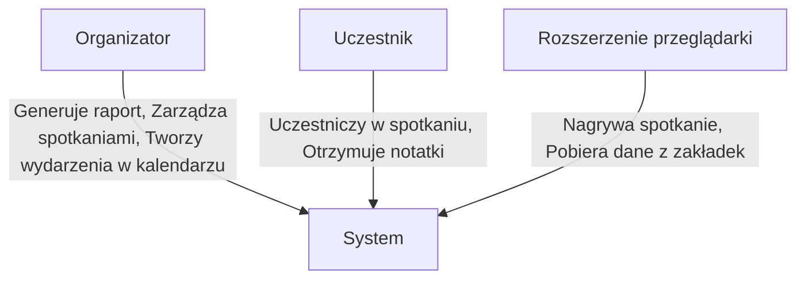
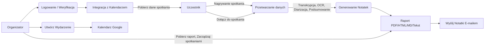
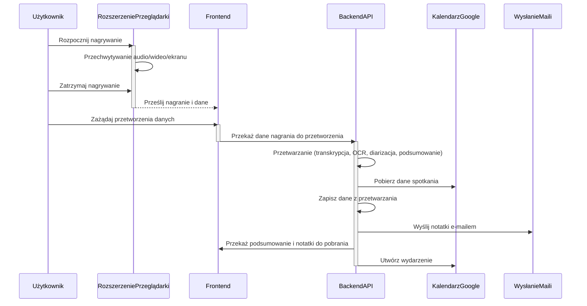

# Dokumentacja projektu: SmartMeetings – Automatyczne transkrypcje i notatki ze spotkań

## Członkowie zespołu:
- **Kamil Hebda**
- **Paweł Klocek**
- **Szymon Gaweł**

---

## 1. Macierz kompetencji zespołu

| Kompetencje              | Kamil | Paweł | Szymon |
|--------------------------|-------|-------|--------|
| Znajomość algorytmów     | TAK   | TAK   | TAK    |
| Uczenie maszynowe        | TAK   | TAK   | NIE    |
| Znajomość j. angielskiego| TAK   | TAK   | TAK    |
| Obsługa GitHub           | TAK   | TAK   | TAK    |
| Programowanie Python     | TAK   | TAK   | TAK    |
| Programowanie SQL        | TAK   | NIE   | TAK    |
| Programowanie C++        | TAK   | NIE   | NIE    |
| Programowanie JavaScript | NIE   | TAK   | TAK    |
| Znajomość API            | TAK   | TAK   | TAK    |
| Praca w grupie           | TAK   | TAK   | TAK    |
| Testowanie oprogramowania| TAK   | TAK   | TAK    |
| React                    | NIE   | NIE   | TAK    |
| HTML                     | TAK   | TAK   | TAK    |
| CSS                      | NIE   | NIE   | TAK    |

---

## 2. Pytania i odpowiedzi związane z projektem

| Pytanie                                 | Odpowiedź                                                                                                                               | Uwagi                                                                                                                                |
|-----------------------------------------|-----------------------------------------------------------------------------------------------------------------------------------------|--------------------------------------------------------------------------------------------------------------------------------------|
| W jakim terminie należy oddać aplikację?| Koniec stycznia 2025                                                                                                                      |                                                                                                                                    |
| Jakie funkcjonalności są priorytetowe?  | Transkrypcja, zapis zrzutów ekranu, OCR                                                                               |                                                                                                   |
| W jakiej formie ma być aplikacja?       | Aplikacja webowa.                                                                        | Może to być także wtyczka do przeglądarki.     |
| Jak zarządzać spotkaniami?              | Integracja z kalendarzem Google, automatyczne pobieranie szczegółów spotkań, generowanie wydarzeń.                          | System może wykorzystywać API Kalendarza Google.                                                                                 |
| Jak generowane są notatki?              | Notatki w formatach PDF, HTML i Markdown.  | Notatki powinny być dostosowane do użytkownika, z możliwością łatwej edycji.                                                   |
| Jakie dane użytkowników są wymagane?    | E-mail uczestnika (do weryfikacji i wysyłki notatek)                                                                        | Dane te są wymagane do wysyłki raportów                                                                                    |
| Czy aplikacja ma wysyłać e-maile?       | TAK, do wysyłania notatek ze spotkań                                            |  Można za pomocą SEND IN BLUE(Brevo), MARGUN.                                                                                                                                    |
| Jak odbywa się nagrywanie?| Nagrywanie ekranu lub zakładki z dźwiękiem, za pomocą rozszerzenia przeglądarki.                                          | Rozszerzenie wykorzystuje chrome.tabCapture oraz desktopCapture API.                                                                                                      |
| Jakie są opcjonalne funkcjonalności priorytetowe?| Identyfikacja mówców, statystyka ile kto powiedział, jak szybko mówi                                          |                                                                                                    |

---

## 3. Format Danych Wejściowych dla SmartMeetings

Poniższa tabela opisuje format danych wejściowych dla różnych punktów interakcji z systemem SmartMeetings.

### 1. Dane Rejestracyjne Użytkownika (Autentykacja)

| Pole        | Typ danych | Opis                                                                 | Wymagane | Przykład                                  |
|-------------|-----------|----------------------------------------------------------------------|----------|------------------------------------------|
| `email`     | String    | Adres email użytkownika, na który zostanie wysłany kod weryfikacyjny.  | Tak      | `user@example.com`                       |
| `code` | String | Kod weryfikacyjny wysłany na email użytkownika | Tak | `123456` |
| `password`   | String    | Hasło użytkownika (opcjonalne w procesie weryfikacji e-mail).                | Nie      | `P@$$wOrd123`                       |

### 2. Dane do Przetwarzania Spotkania (Backend API)

#### 2.1 Nagranie Wideo (Upload)

| Pole            | Typ danych | Opis                               | Wymagane | Przykład                                                 |
|-----------------|-----------|------------------------------------|----------|----------------------------------------------------------|
| `video_file`    | File (Multipart) | Plik wideo ze spotkania (w formacie .webm lub innych). | Tak      | Plik binarny `meeting.webm`                              |

#### 2.2 Generowanie Notatek

| Pole           | Typ danych | Opis                                                                                                  | Wymagane | Przykład                                                                             |
|----------------|-----------|-------------------------------------------------------------------------------------------------------|----------|--------------------------------------------------------------------------------------|
| `video_path`  | String    | Ścieżka do pliku wideo, gdzie znajduje się nagranie.                                                           | Tak      | `static/uploads/meeting1.webm`                               |
| `options`      | JSON      | Opcje generowania notatek, w tym `transcription`, `ocr`, `screenshot`, `diarization`.  | Tak      | `{"transcription": true, "ocr": true, "screenshot": false, "diarization": true}`        |
| `screenshots`  | Array[String] | Lista ścieżek do zrzutów ekranu.                                                                           | Nie | `["static/screenshots/meeting1/00m10s200ms.jpg", "static/screenshots/meeting1/01m30s400ms.jpg"]` |

#### 2.3 Generowanie Podsumowania

| Pole      | Typ danych | Opis                                   | Wymagane | Przykład                     |
|-----------|-----------|----------------------------------------|----------|------------------------------|
| `text`    | String    | Tekst do podsumowania (np. transkrypcja). | Tak      | `To jest tekst do podsumowania` |
| `prompt` | String | Prompt do chatu | Tak | `Zrób podsumowanie tego tekstu w trzech punktach` |

#### 2.4 Generowanie Zrzutów Ekranu

| Pole          | Typ danych | Opis                     | Wymagane | Przykład              |
|---------------|-----------|--------------------------|----------|-----------------------|
| `video_path`  | String    | Ścieżka do pliku wideo.  | Tak      | `static/uploads/meeting1.webm`  |

### 3. Dane do Wysyłki Notatek (Backend API)

| Pole            | Typ danych  | Opis                                                | Wymagane | Przykład                                                |
|-----------------|--------------|-----------------------------------------------------|----------|---------------------------------------------------------|
| `reciever`   | JSON string    | Lista adresów e-mail odbiorców w formacie JSON. | Tak      | `[{"email": "user1@example.com"}, {"email": "user2@example.com"}]`                |
| `subject`     | String       | Temat wiadomości e-mail.                           | Tak      | `Notatki ze spotkania`                      |
| `notes`       | String       | Treść notatek do wysłania.                     | Tak      | `Tutaj są notatki ze spotkania`                    |
| `files`     | Array[File]       | Lista załączników.                          | Nie      | `[file1.pdf, file2.png]`                     |

### 4. Dane do Kalendarza Google (Backend API)

#### 4.1 Pobieranie Wydarzeń

(Brak danych wejściowych, tylko odpowiedź)

#### 4.2 Tworzenie Wydarzenia

| Pole            | Typ danych | Opis                                                                            | Wymagane | Przykład                                                                                    |
|-----------------|-----------|---------------------------------------------------------------------------------|----------|---------------------------------------------------------------------------------------------|
| `summary`       | String    | Tytuł wydarzenia.                                                                | Tak      | `Spotkanie Projektowe`                                                                      |
| `location`      | String    | Lokalizacja wydarzenia.                                                            | Nie      | `Sala Konferencyjna`                                                                         |
| `description`   | String    | Opis wydarzenia.                                                                 | Nie      | `Omówienie postępów projektu`                                                              |
| `start_date`   | JSON    | Data i czas rozpoczęcia wydarzenia (wraz ze strefą czasową).                 | Tak     | `{"dateTime": "2024-07-28T10:00:00", "timeZone": "Europe/Warsaw"}`                                                     |
| `end_date`     | JSON       | Data i czas zakończenia wydarzenia (wraz ze strefą czasową).                 | Tak      | `{"dateTime": "2024-07-28T12:00:00", "timeZone": "Europe/Warsaw"}`                                                    |
| `attendees`     | Array[JSON]   | Lista uczestników wydarzenia w formacie JSON  z emailami.                                                    | Nie       | `[{"email": "user1@example.com"}, {"email": "user2@example.com"}]`                 |
| `reminders`   | JSON   | Ustawienia przypomnień o wydarzeniu.                                | Nie      | `{"useDefault": false, "overrides": [{"method": "email", "minutes": 30}, {"method": "popup", "minutes": 10}]}`                                                    |

### 5. Dane z rozszerzenia przeglądarki

#### 5.1 Rozpoczęcie nagrywania
(Dane przekazywane wewnątrz rozszerzenia, nie są przesyłane z zewnątrz)

#### 5.2 Zatrzymanie nagrywania
(Dane przekazywane wewnątrz rozszerzenia, nie są przesyłane z zewnątrz)

---

## 4. Opis modelowanego systemu

|                              |                                                                                                                                                                                                                          |
|------------------------------|--------------------------------------------------------------------------------------------------------------------------------------------------------------------------------------------------------------------------|
| **Aktorzy**                  | Uczestnik spotkania, Organizator spotkania, Rozszerzenie przeglądarki                                                                                                                           |
| **Opis**                     | Celem działania systemu jest automatyczne generowanie notatek, raportów, podsumowań i transkrypcji spotkań, a także wysyłkę raportów do uczestników. Dodatkowo rejestracja zrzutów ekranu, analiza treść prezentacji (OCR).        |
| **Dane**                     |  Treść rozmów (transkrypcja), zrzuty ekranu, dane z prezentacji (OCR), dane z kalendarza Google (uczestnicy, czas) podsumowania spotkań.                               |
| **Wyzwalacz**                | Organizator/Użytkownik – przycisk „Zakończ i wygeneruj raport” (w web aplikacji lub rozszerzeniu przeglądarki).                                                                                   |
| **Odpowiedź**                | Raport w wybranym formacie: PDF, HTML, MD. |
| **Uwagi**                    | System powinien działać z platformami Zoom i Google Meet, wspierać nagrywanie ekranu lub zakładki z dźwiękiem.        |

---

## 5. Diagramy UML:

### Diagram przypadków użycia

### Diagram przepływu danych

### Diagram sekwencyjny UML

---

## 6. Architektura systemu

Poniżej przedstawiono ogólną architekturę systemu SmartMeetings, która składa się z trzech głównych etapów: **Start - Wejście**, **Przetwarzanie** i **Koniec - Wyjście**.

### Diagram Architektury Systemu

| **Start - Wejście**                               | **Przetwarzanie**                             | **Koniec - Wyjście**                        |
|---------------------------------------------------|-----------------------------------------------|---------------------------------------------|
| **Rozszerzenie Przeglądarki**                     | **Backend API**                               | **Panel Webowy Użytkownika**                |
| - Nagranie (audio/wideo/ekran)                    | - Transkrypcja                                | - Notatki i Podsumowania                    |
| - Komunikacja z Backend API                       | - OCR                                         | - Pobieranie Plików                         |
|                                                   | - Diarizacja                                  | - Wydarzenia Kalendarza                     |
|                                                   | - Podsumowanie                                | - E-maile                                   |
|                                                   | - Pobieranie danych ze spotkań z Kalendarza   |                                             |
|                                                   | - Uwierzytelnianie użytkowników               |                                             |
|                                                   | - Wysyłka e-maili                             |                                             |

### Opis Etapów

**Start - Wejście**:
- **Rozszerzenie Przeglądarki**:
  - Przechwytuje audio, wideo i dane ekranu.
  - Komunikuje się z Backend API, przekazując zebrane dane.

**Przetwarzanie**:
- **Backend API**:
  - Przetwarza dane poprzez transkrypcję, OCR, diarizację i podsumowanie.
  - Pobiera dane ze spotkań z Kalendarza Google.
  - Zarządza zapisywaniem danych, uwierzytelnianiem użytkowników oraz wysyłką maili z notatkami.

**Koniec - Wyjście**:
- **Panel Webowy Użytkownika**:
  - Umożliwia użytkownikom dostęp do notatek, podsumowań oraz zarządzanie kalendarzem.
  - Obsługuje pobieranie plików oraz wysyłkę e-maili.

### Zewnętrzne Usługi

- **Kalendarz Google**: Pobieranie i tworzenie wydarzeń.
- np. **Sendinblue API**: Wysyłka e-maili z notatkami i kodami weryfikacyjnymi.

## 7. Język implementacji

- **Frontend:** HTML, CSS, JavaScript (React)
- **Backend:** Python (Flask)
- **Rozszerzenie przeglądarki:** JavaScript, HTML, CSS

**Uzasadnienie:** Python jest elastycznym językiem wspierającym wiele bibliotek do analizy audio i wideo, JavaScript/React jest standardem dla UI, a wtyczki dobrze integrują się z przeglądarkami i mogą przechwytywać dane z ekranu i karty. Wybrane technologie pozwalają na efektywną współpracę między frontendem, backendem a rozszerzeniem przeglądarki.
